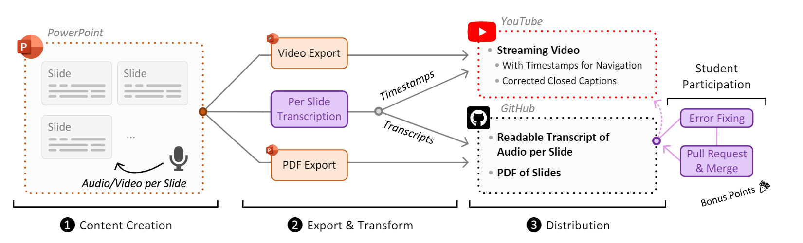
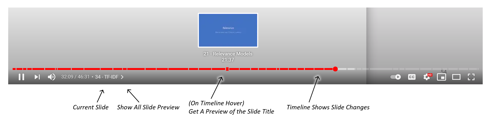
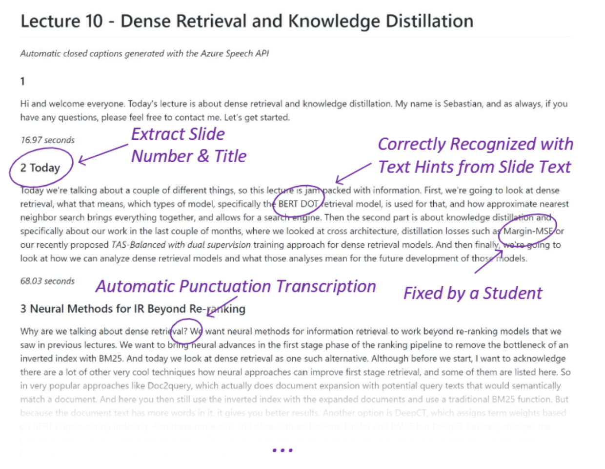

# Our Time-Optimized Content Creation Workflow for Remote Teaching

Check out our full paper for an in-depth evaluation of our methods published at the SIGSCE Technical Symposium 2022: 

*A Time-Optimized Content Creation Workflow for Remote Teaching*  Sebastian Hofstätter, Sophia Althammer, Mete Sertkan and Allan Hanbury

https://arxiv.org/abs/2110.05601

----

*Please feel free to open up an issue or a pull request if you want to add something, find a mistake, or think something should be explained better!*

Our workflow creates an engaging remote learning experience for a university course, while minimizing the post-production time of the educators. We make use of ubiquitous and commonly free services and platforms, so that our workflow is inclusive for all educators and provides polished experiences for students. Our learning materials provide for each lecture: 1) a recorded video, uploaded on YouTube, with exact slide timestamp indices, which enables an enhanced navigation UI; and 2) a high-quality flow-text automated transcript of the narration with proper punctuation and capitalization, improved with a student participation workflow on GitHub. We automate the transformation and post-production between raw narrated slides and our published materials with a custom toolchain.


*Overview of our content creation & dissemination workflow:* ➊ *We create our presentations in PowerPoint and add narrations per slide;* ➋ *We use both the native export functionality of PowerPoint and our custom slide transcription program;* ➌ *We distribute the exported formats on YouTube and GitHub. We also encourage students to fix transcripts, which we then use to improve the closed captions on YouTube as well.*

## Results

An example for the final product of our workflow can be found [here](https://github.com/sebastian-hofstaetter/teaching/tree/master/advanced-information-retrieval). Now, we briefly highlight two cool points: 

### 1. YouTube Chapter UI

Once we copied the timestamps with titles into the description field of a YouTube video, the following UI is enabled (as of summer 2021):


*YouTube chapters*

### 2. Transcripts on GitHub

Our transformation script produces transcripts in Markdown format, which are rendered and editable on GitHub and look as follows:


*Transcript features*

## Requirements


To use our transformation tools you need the following:

- A narrated PowerPoint file (.pptx) - to create such a narrated file use the Recording tab in PowerPoint. Use PowerPoint to export a video.
- Python 3 (and the requirements installed via pip install -r requirements.txt)
- An API key for Azure speech recognition (follow the descriptions here: https://azure.microsoft.com/en-us/services/cognitive-services/speech-to-text/)


## Tools

Our main transformation tool is ``transform_from_pptx.py``. For every presentation , you can call it as follows:

````
python transform_from_pptx.py --in-pptx "your power point file" --out-cc "the location of the transcript" --azure-key "the azure API key"
````

Once a transcript in the Markdown text format has been corrected or augmented by a human, we can simply convert the rich text format back into the raw transcribed words with: ``transcript_to_youtube_cc.py``.

````
python transcript_to_youtube_cc.py --in-files "a glob of files (like a directory with /*.md at the end or a single file)" --out-folder "folder to put the raw sentences, uses the same filename as the input files"
````

The output of this script can be copied into the YouTube closed caption editor and will be automatically mapped to the timestamps the text occurs in. Generally YouTube's automatic closed captions are on par with Azure speech recognition (in that they commonly mistake acronyms), so applying fixed transcripts will improve them. 

## Citation

If this workflow is useful for you and you happen to publish a paper 📄 please cite us as:
````
@inproceedings{hofstaetter2022_teaching_workflow,
    title={A Time-Optimized Content Creation Workflow for Remote Teaching}, 
    author={Sebastian Hofst{\"a}tter and Sophia Althammer and Mete Sertkan and Allan Hanbury},
    year={2022},
    booktitle = {Proc. of SIGSCE-TS},
}
````